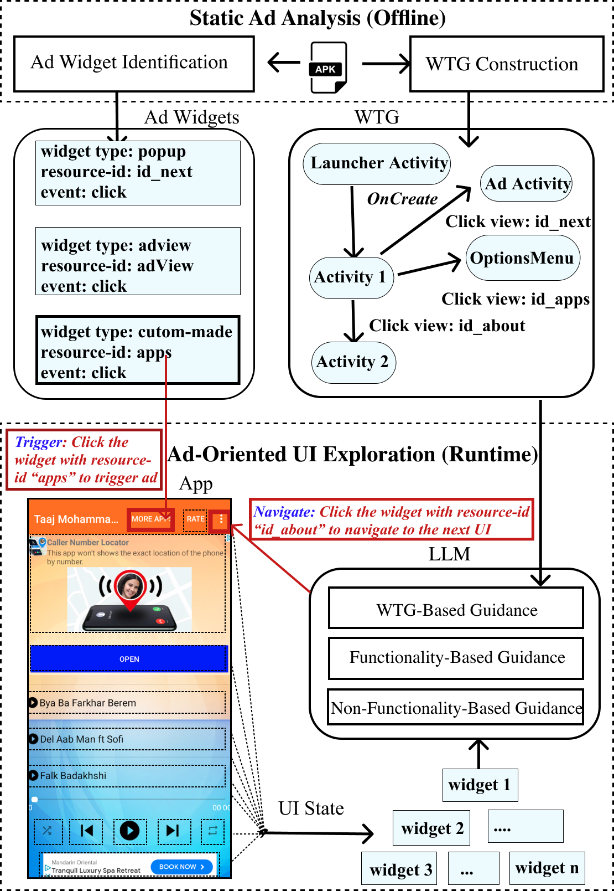

# AdWise
Mobile advertisements (ads) fuel the app economy, yet poorly regulated ads can degrade user experience and even expose users to malware. Identifying ad regulation violations is challenging because ads are dynamically retrieved from remote servers and embedded across various user interfaces (UIs), making them difficult to locate and trigger. To address these challenges, we propose AdWise, which innovatively harnesses Large Language Models (LLMs) to unify static ad analysis and dynamic UI exploration for detecting mobile ads and assisting ad regulation. In particular, AdWise first develops novel static analysis to build a window transition graph (WTG) that represents transitions among UIs and identifies UI widgets used to place ads (referred to as ad widgets) in the WTG. AdWise then instructs the LLM to guide dynamic UI exploration for finding ad widgets based on the static analysis results. More importantly, to guide LLMs in effectively finding ad widgets, we design ADWISE by leveraging insights from two strategies commonly employed by developers for ad widget placement: (1) functionality-based guidance: AdWise summarizes apps’ functionality as guidance since developers often position ads on UIs that the app’s target users are most likely to visit; (2) non-functionality-based guidance: AdWise finds similar UIs for the visited UIs from a knowledge base of UIs that contain ad widgets, and generates guidance to help LLMs find ad widgets. The generated guidance, combined with the WTG, allows LLMs to find exploration paths that are more likely to uncover ad widgets. Our evaluation shows that AdWise effectively detects mobile ads with a detection rate of 75.86% across 156 ad widgets and identifies 510 instances of violations spanning 6 categories of impactful ad regulations in 200 real-world apps, demonstrating its practical utility.


## 1.Dataset and Groundtruth

We have released our full dataset in [google drive](https://drive.google.com/drive/folders/1dTLBSfQLyrNx1qM72OStax8T5H1eYT7_?usp=sharing
)

You can use [the notebook](Groundtruth/readGroundtruth.ipynb) to read our labeled ad widgets. 

The APK files are too large. You can download them using AndroZoo
```bash
curl -o filename.apk "https://androzoo.uni.lu/api/download?apikey=YOUR_API_KEY&sha256=SHA256_HASH_OF_APK"
```

We have put 3 APK files [here](Groundtruth/apks), the rest of the repo will analyze these APKs.

## 2.Static Analysis
The static ad analysis is built in Java 8 (we use jdk corretto 1.8) Android 22

The deployment of android environment of our static ad analysis requires non-trivial effort.
Therefore, we have constructed a docker image of the project and published in
`maishang9/adsuite`


Command to run static ad analysis

```bash
docker pull maishang9/adsuite
   
docker run -dit -v project_dir/Groundtruth/:/data -v project_dir/StaticAnalysis/staticAdAnalysis:/gator maishang9/adsuite /bin/bash
```
The static analysis may take quite long time (depending on your setting). Therefore, you'd better detach the container.

```bash
docker exec -it {container_id} /bin/bash

conda activate myenv && cd gator/

python run_gator.py --apk_dir /data/apks --adk_dir /usr/local/android-sdk-linux

```

Once you have successfully run the code, you will have three output directory under the `{Static Ad Analysis Directory}` : 
- `json_output/` : the ad widgets. Each apk outputs a json, the json include all widgets/view id/event handler of the apk. 
To help visualize the data, we put the code that extracts ad widgets in a jupyter notebook. 
Please run [the notebook](StaticAnalysis/static2dynamic.ipynb), which will generate a directory `csv/` to store the ad widgets in csv format.
- `dot_output`: the WTGs. They are already in good dot format, you can visualize them using graphiz.
- `log_output`: the logs, which you can view the static process.

and a `result.txt` used to resume the static ad analysis (please see `run_gator.py` for how to rerun, redo failed apk)


Then, move the `csv/` to `UIExploration/data/csv/`, and `dot_output` to `UIExploration/data/dot/`.
We have put 3 examples `.csv` and `.dot` file there. 


## 3.UI Exploration


The Ad-oriented UI Exploration is built upon Guardian [ISSTA 2024] framework. Our modification and enhancement of Guardian is mainly in \
- [atg.py](UIExploration/atg.py): The code to process WTG dot file, make prompts
- [rag.py](UIExploration/rag.py): The RAG code
- [guardian.py](UIExploration/guardian.py): The main UI Exploration framework


Below are the steps to reproduce our evaluation
1. configure Openai api key as `UIExploration/api.key`
2. Run rag.py to create rag embedding
2. Run [test_adsuite.py](UIExploration/test_adsuite.py)


